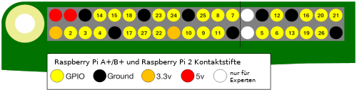

GPIO ist eine Abkürzung für **G**eneral **P**urpose **I**nput /**O**utput (universelle ein-/Ausgänge). Ein Raspberry Pi hat 26 GPIO-Stifte (pins). Diese erlauben es dir Ein-/Aus-Signale an und von elektronischen Komponenten wie LEDs, Motoren und Tasten zu senden und empfangen.

Wenn du dir einen Raspberry Pi ansiehst dessen USB-Anschlüsse in deine Richtung zeigen, ist die Anordnung der GPIO-Anschlüsse wie folgt.

|                     |                     |
| -------------------:|:------------------- |
|                 3V3 | 5V                  |
|           **GPIO2** | 5V                  |
|           **GPIO3** | GND/Masse           |
|           **GPIO4** | **GPIO14**          |
|           GND/Masse | **GPIO15**          |
|          **GPIO17** | **GPIO18**          |
|          **GPIO27** | GND/Masse           |
|          **GPIO22** | **GPIO23**          |
|                 3V3 | **GPIO24**          |
|          **GPIO10** | GND/Masse           |
|           **GPIO9** | **GPIO25**          |
|          **GPIO11** | **GPIO8**           |
|           GND/Masse | **GPIO7**           |
| DNC/nicht verwenden | DNC/nicht verwenden |
|           **GPIO5** | GND/Masse           |
|           **GPIO6** | **GPIO12**          |
|          **GPIO13** | GND/Masse           |
|          **GPIO19** | **GPIO16**          |
|          **GPIO26** | **GPIO20**          |
|           GND/Masse | **GPIO21**          |

Jeder Pin hat eine Nummer und es gibt zusätzliche Pins, die 3,3 Volt, 5 Volt und Erdungsverbindungen bereitstellen.

Hier ist ein weiteres Diagramm, das die Anordnung der Stifte zeigt. Es zeigt auch einige optionale zusätzliche Anschlüsse.

Hier ist eine Tabelle mit einer kurzen Erklärung.

| Abkürzung             | Vollständiger Name | Funktion                                                                                                          |
| --------------------- | ------------------ | ----------------------------------------------------------------------------------------------------------------- |
| 3V3                   | 3,3 Volt           | Alles, was an diese Stifte angeschlossen ist, wird immer mit 3,3 V versorgt                                       |
| 5V                    | 5 Volt             | Alles, was an diese Stifte angeschlossen ist, wird immer mit 5 V versorgt                                         |
| GND                   | Masse/GND          | Null Volt, zur Vervollständigung der Stromkreise                                                                  |
| GP2                   | GPIO Sift 2        | Diese Stifte sind für den allgemeinen Gebrauch bestimmt und können als Eingänge oder Ausgänge konfiguriert werden |
| ID_SC/ID_SD/DNC |                    | Spezialstifte                                                                                                     |
