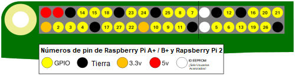

GPIO es un acrónimo de **G**eneral **P**urpose **I**nput /**O**utput. (Nota: "Entrada y Salida de Propósito General"). Una Raspberry Pi tiene 26 pines GPIO. Estos le permiten enviar y recibir señales de encendido / apagado desde y hacia componentes electrónicos como LEDs, motores y botones.

Si observas una Raspberry Pi con los puertos USB orientados hacia tí, el diseño de los pines GPIO es el siguiente.

|            |            |
| ----------:|:---------- |
|        3V3 | 5V         |
|  **GPIO2** | 5V         |
|  **GPIO3** | GND        |
|  **GPIO4** | **GPIO14** |
|        GND | **GPIO15** |
| **GPIO17** | **GPIO18** |
| **GPIO27** | GND        |
| **GPIO22** | **GPIO23** |
|        3V3 | **GPIO24** |
| **GPIO10** | GND        |
|  **GPIO9** | **GPIO25** |
| **GPIO11** | **GPIO8**  |
|        GND | **GPIO7**  |
|        DNC | DNC        |
|  **GPIO5** | GND        |
|  **GPIO6** | **GPIO12** |
| **GPIO13** | GND        |
| **GPIO19** | **GPIO16** |
| **GPIO26** | **GPIO20** |
|        GND | **GPIO21** |

Cada pin tiene un número, y hay pines adicionales que proporcionan conexiones de 3,3 voltios, 5 voltios y tierra.

Aquí hay otro diagrama que muestra el diseño de los pines. También muestra algunos de los pines especiales opcionales.

Aquí hay una tabla con una breve explicación.

| Abreviatura       | Nombre completo | Función                                                                                |
| ----------------- | --------------- | -------------------------------------------------------------------------------------- |
| 3V3               | 3,3 voltios     | Cualquier cosa conectada a estos pines siempre obtendrá 3.3V de potencia               |
| 5V                | 5 voltios       | Cualquier cosa conectada a estos pines siempre tendrá 5V de potencia.                  |
| GND               | tierra          | Cero voltios, usado para completar un circuito                                         |
| GP2               | GPIO pin 2      | Estos pines son para uso general y se pueden configurar como pines de entrada o salida |
| ID_SC/ID_SD/DNC |                 | Pines especiales                                                                       |
