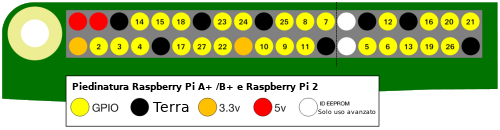

GPIO è l'acronimo di **G**eneral **P**urpose **I**nput /**O**utput (ingresso/uscita ad uso generico). Un Raspberry Pi ha 26 pin GPIO. Questi ti consentono di inviare e ricevere segnali acceso/spento da e verso componenti elettronici come LED, motori e pulsanti.

Se guardi un Raspberry Pi con le porte USB rivolte verso di te, la disposizione dei pin GPIO è la seguente.

|            |            |
| ----------:|:---------- |
|        3V3 | 5V         |
|  **GPIO2** | 5V         |
|  **GPIO3** | GND        |
|  **GPIO4** | **GPIO14** |
|        GND | **GPIO15** |
| **GPIO17** | **GPIO18** |
| **GPIO27** | GND        |
| **GPIO22** | **GPIO23** |
|        3V3 | **GPIO24** |
| **GPIO10** | GND        |
|  **GPIO9** | **GPIO25** |
| **GPIO11** | **GPIO8**  |
|        GND | **GPIO7**  |
|        DNC | DNC        |
|  **GPIO5** | GND        |
|  **GPIO6** | **GPIO12** |
| **GPIO13** | GND        |
| **GPIO19** | **GPIO16** |
| **GPIO26** | **GPIO20** |
|        GND | **GPIO21** |

Ogni pin ha un numero e ci sono pin aggiuntivi che forniscono connessioni a 3,3 Volt, 5 Volt e Terra.

Ecco un altro diagramma che mostra la disposizione dei pin. Mostra anche alcuni dei pin speciali opzionali.

Ecco una tabella con una breve spiegazione.

| Abbreviazione     | Nome completo | Funzione                                                                                 |
| ----------------- | ------------- | ---------------------------------------------------------------------------------------- |
| 3V3               | 3,3 volt      | Qualsiasi cosa collegata a questi pin otterrà sempre una corrente a 3,3V                 |
| 5V                | 5 volt        | Qualsiasi cosa collegata a questi pin otterrà sempre una correnta a 5V                   |
| GND               | terra         | Zero volt, utilizzato per completare un circuito                                         |
| GP2               | Pin GPIO 2    | Questi pin sono per uso generico e possono essere configurati come pin di input o output |
| ID_SC/ID_SD/DNC |               | Pin per usi speciali                                                                     |
