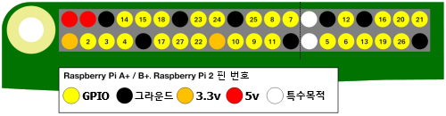

GPIO는 **G**eneral **P**urpose **I**nput/**O**utput의 약자입니다. 라즈베리파이에는 26개의 GPIO 핀이 있습니다. 이를 통해 LED, 모터 및 버튼과 같은 전자 부품과 신호를 주고 받을 수 있습니다.

USB 포트가 사용자를 향한 상태에서 Raspberry Pi를 보면 GPIO 핀의 배치는 다음과 같습니다.

|            |            |
| ----------:|:---------- |
|        3V3 | 5V         |
|  **GPIO2** | 5V         |
|  **GPIO3** | GND        |
|  **GPIO4** | **GPIO14** |
|        GND | **GPIO15** |
| **GPIO17** | **GPIO18** |
| **GPIO27** | GND        |
| **GPIO22** | **GPIO23** |
|        3V3 | **GPIO24** |
| **GPIO10** | GND        |
|  **GPIO9** | **GPIO25** |
| **GPIO11** | **GPIO8**  |
|        GND | **GPIO7**  |
|        DNC | DNC        |
|  **GPIO5** | GND        |
|  **GPIO6** | **GPIO12** |
| **GPIO13** | GND        |
| **GPIO19** | **GPIO16** |
| **GPIO26** | **GPIO20** |
|        GND | **GPIO21** |

각 핀에는 숫자가 있으며 3.3V, 5V 및 접지 연결을 제공하는 추가 핀이 있습니다.

다음은 핀의 배치를 보여주는 또 다른 그림입니다. 선택 사항인 특수 핀도 보여줍니다.

다음은 간단한 설명이 있는 표입니다.

| 약어                | 의미       | 기능                                      |
| ----------------- | -------- | --------------------------------------- |
| 3V3               | 3.3 볼트   | 이 핀에 연결된 것은 항상 3.3V의 전원을 공급받습니다         |
| 5V                | 5 볼트     | 이 핀에 연결된 것은 항상 5V의 전원을 공급받습니다           |
| GND               | 바닥       | 전위가 0V로, 회로를 완성하는 데 사용합니다.              |
| GP2               | GPIO 핀 2 | 이 핀은 범용으로 사용되며 입력 또는 출력 핀으로 구성 할 수 있습니다 |
| ID_SC/ID_SD/DNC |          | 특수 목적 핀                                 |
