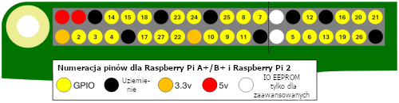

GPIO jest akronimem **G**eneral **P**urpose **I**nput/**O**utput (uniwersalne wejścia/wyjścia). Raspberry Pi ma 26 pinów GPIO. Umożliwiają one wysyłanie i odbieranie sygnałów włączania/wyłączania do i z elementów elektronicznych, takich jak diody LED, silniki i przyciski.

Jeśli spojrzysz na Raspberry Pi z portami USB skierowanymi do siebie, układ pinów GPIO jest następujący.

|            |            |
| ----------:|:---------- |
|        3V3 | 5V         |
|  **GPIO2** | 5V         |
|  **GPIO3** | GND        |
|  **GPIO4** | **GPIO14** |
|        GND | **GPIO15** |
| **GPIO17** | **GPIO18** |
| **GPIO27** | GND        |
| **GPIO22** | **GPIO23** |
|        3V3 | **GPIO24** |
| **GPIO10** | GND        |
|  **GPIO9** | **GPIO25** |
| **GPIO11** | **GPIO8**  |
|        GND | **GPIO7**  |
|        DNC | DNC        |
|  **GPIO5** | GND        |
|  **GPIO6** | **GPIO12** |
| **GPIO13** | GND        |
| **GPIO19** | **GPIO16** |
| **GPIO26** | **GPIO20** |
|        GND | **GPIO21** |

Każdy pin ma swój numer i są też dodatkowe piny, które dostarczają 3,3 woltów, 5 woltów i uziemienie(GND).

Oto kolejny schemat przedstawiający układ pinów. Pokazuje także niektóre opcjonalne specjalne piny.

Oto tabela z krótkim wyjaśnieniem.

| Skrót                 | Pełna nazwa | Funkcja                                                                                               |
| --------------------- | ----------- | ----------------------------------------------------------------------------------------------------- |
| 3V3                   | 3,3 wolta   | Wszystko podłączone do tych pinów będzie zasilane napięciem 3,3 V.                                    |
| 5 V                   | 5 woltów    | Wszystko, co jest podłączone do tych pinów, otrzyma 5 V napięcia                                      |
| GND                   | uziemienie  | Zero woltów, używane do zamknięcia obwodu                                                             |
| GPIO2                 | Pin GPIO 2  | Te piny są przeznaczone do użytku ogólnego i mogą być konfigurowane jako piny wejściowe lub wyjściowe |
| ID_SC / ID_SD / DNC |             | Piny specjalnego przeznaczenia                                                                        |
