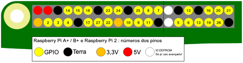

GPIO é um acrônimo para **G**eneral **P**urpose **I**nput/**O**utput (Entrada e Saída de Uso Geral). Um Raspberry Pi possui 26 pinos GPIO. Isso permite enviar e receber sinais liga/desliga de e para componentes eletrônicos, como LEDs, motores e botões.

Se você olhar para um Raspberry Pi com as portas USB voltadas para você, a disposição dos pinos GPIO é a seguinte.

|            |            |
| ----------:|:---------- |
|        3V3 | 5V         |
|  **GPIO2** | 5V         |
|  **GPIO3** | GND        |
|  **GPIO4** | **GPIO14** |
|        GND | **GPIO15** |
| **GPIO17** | **GPIO18** |
| **GPIO27** | GND        |
| **GPIO22** | **GPIO23** |
|        3V3 | **GPIO24** |
| **GPIO10** | GND        |
|  **GPIO9** | **GPIO25** |
| **GPIO11** | **GPIO8**  |
|        GND | **GPIO7**  |
|        DNC | DNC        |
|  **GPIO5** | GND        |
|  **GPIO6** | **GPIO12** |
| **GPIO13** | GND        |
| **GPIO19** | **GPIO16** |
| **GPIO26** | **GPIO20** |
|        GND | **GPIO21** |

Cada pino tem um número e existem pinos adicionais que fornecem conexões de 3,3 Volts, 5 Volts e Terra.

Aqui está outro diagrama mostrando a disposição dos pinos. Também mostra alguns dos pinos especiais opcionais.

Aqui está uma tabela com uma breve explicação.

| Abreviação            | Nome completo  | Função                                                                                 |
| --------------------- | -------------- | -------------------------------------------------------------------------------------- |
| 3V3                   | 3,3 Volts      | Qualquer coisa conectada a esses pinos sempre terá 3,3V de tensão                      |
| 5V                    | 5 Volts        | Qualquer coisa conectada a esses pinos sempre terá 5V de tensão                        |
| GND                   | Terra          | Zero volts, usado para completar um circuito                                           |
| GP2                   | Pino 2 do GPIO | Esses pinos são para uso geral e podem ser configurados como pinos de entrada ou saída |
| ID_SC/ID_SD/DNC |                | Pinos para fins especiais                                                              |
