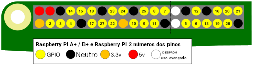

GPIO é um acrónimo para **G**eneral (geral) **P**urpose (propósito)**I**nput (entrada)/ **O**utput (saída). (Pinos de entrada/saída para uso generalizado). Um Raspberry Pi possui 26 pinos GPIO. Isso permite enviar e receber sinais liga/desliga de e para componentes eletrónicos, como LEDs, motores e botões.

Se tu olhares para um Raspberry Pi com as portas USB voltadas para ti, a disposição dos pinos GPIO é a seguinte.

|            |            |
| ----------:|:---------- |
|        3V3 | 5V         |
|  **GPIO2** | 5V         |
|  **GPIO3** | GND        |
|  **GPIO4** | **GPIO14** |
|        GND | **GPIO15** |
| **GPIO17** | **GPIO18** |
| **GPIO27** | GND        |
| **GPIO22** | **GPIO23** |
|        3V3 | **GPIO24** |
| **GPIO10** | GND        |
|  **GPIO9** | **GPIO25** |
| **GPIO11** | **GPIO8**  |
|        GND | **GPIO7**  |
|        DNC | DNC        |
|  **GPIO5** | GND        |
|  **GPIO6** | **GPIO12** |
| **GPIO13** | GND        |
| **GPIO19** | **GPIO16** |
| **GPIO26** | **GPIO20** |
|        GND | **GPIO21** |

Cada pino tem um número e existem pinos adicionais que fornecem ligações de 3.3 Volts, 5 Volts e Neutro.

Aqui está outro diagrama que mostra a disposição dos pinos. Também mostra alguns dos pinos especiais e opcionais.

Aqui está uma tabela com uma breve explicação.

| Abreviação            | Nome completo  | Função                                                                                 |
| --------------------- | -------------- | -------------------------------------------------------------------------------------- |
| 3V3                   | 3.3 volts      | Qualquer coisa ligada a estes pinos terá sempre 3.3V de energia                        |
| 5V                    | 5 volts        | Qualquer coisa ligada a estes pinos terá sempre 5V de energia                          |
| GND                   | neutro         | Zero volts, usado para fechar um circuito                                              |
| GP2                   | Pino 2 do GPIO | Estes pinos são para uso geral e podem ser configurados como pinos de entrada ou saída |
| ID_SC/ID_SD/DNC |                | Pinos com funções especiais                                                            |
