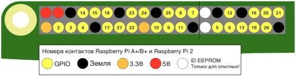

GPIO является аббревиатурой от **G**eneral **P**urpose **I**nput/**O**utput. Raspberry Pi имеет 26 контактов GPIO. Они позволяют получать и отправлять сигналы включения/выключения на электронные компоненты, такие как светодиоды, моторы и кнопки, и от них.

Если вы посмотрите на Raspberry Pi со стороны USB порта, обращенного на вас, расположение контактов GPIO выглядит следующим образом.

|            |            |
| ----------:|:---------- |
|        3V3 | 5V         |
|  **GPIO2** | 5V         |
|  **GPIO3** | GND        |
|  **GPIO4** | **GPIO14** |
|        GND | **GPIO15** |
| **GPIO17** | **GPIO18** |
| **GPIO27** | GND        |
| **GPIO22** | **GPIO23** |
|        3V3 | **GPIO24** |
| **GPIO10** | GND        |
|  **GPIO9** | **GPIO25** |
| **GPIO11** | **GPIO8**  |
|        GND | **GPIO7**  |
|        DNC | DNC        |
|  **GPIO5** | GND        |
|  **GPIO6** | **GPIO12** |
| **GPIO13** | GND        |
| **GPIO19** | **GPIO16** |
| **GPIO26** | **GPIO20** |
|        GND | **GPIO21** |

Каждый контакт имеет номер, и есть дополнительные контакты, которые обеспечивают 3,3 Вольта, 5 Вольт и заземление.

Вот еще одна схема, показывающая расположение контактов. Тут также показаны некоторые дополнительные специальные контакты.

Вот таблица с кратким объяснением.

| Сокращение        | Полное имя     | Назначение                                                                                                   |
| ----------------- | -------------- | ------------------------------------------------------------------------------------------------------------ |
| 3V3               | 3,3 вольта     | Все, что подключено к этим контактам, всегда получит напряжение 3,3 В                                        |
| 5V                | 5 вольт        | Все, что подключено к этим контактам, всегда получит напряжение 5 В                                          |
| GND               | земля          | Ноль вольт, используется для завершения цепи                                                                 |
| GP2               | контакт GPIO 2 | Эти контакты предназначены для общего использования и могут быть настроены как входные или выходные контакты |
| ID_SC/ID_SD/DNC |                | Контакты специального назначения                                                                             |
