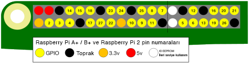

GPIO, **G**eneral (Genel) **P**urpose (Amaçlı) **I**nput (Giriş) /**O**utput (Çıkış) kısaltmasıdır. Bir Raspberry Pi'nin 26 GPIO pini vardır. Bunlar, LED'ler, motorlar ve düğmeler gibi elektronik bileşenlere / bileşenlerinden açma / kapama sinyalleri göndermenizi ve almanızı sağlar.

USB bağlantı noktaları size bakacak şekilde bir Raspberry Pi'ye bakarsanız, GPIO pinlerinin düzeni aşağıdaki gibidir.

|            |            |
| ----------:|:---------- |
|        3V3 | 5V         |
|  **GPIO2** | 5V         |
|  **GPIO3** | GND        |
|  **GPIO4** | **GPIO14** |
|        GND | **GPIO15** |
| **GPIO17** | **GPIO18** |
| **GPIO27** | GND        |
| **GPIO22** | **GPIO23** |
|        3V3 | **GPIO24** |
| **GPIO10** | GND        |
|  **GPIO9** | **GPIO25** |
| **GPIO11** | **GPIO8**  |
|        GND | **GPIO7**  |
|        DNC | DNC        |
|  **GPIO5** | GND        |
|  **GPIO6** | **GPIO12** |
| **GPIO13** | GND        |
| **GPIO19** | **GPIO16** |
| **GPIO26** | **GPIO20** |
|        GND | **GPIO21** |

Her pinin bir numarası vardır ve ayrıca 3.3 Volt, 5 Volt ve Toprak bağlantısı sağlayan ek pinler vardır.

Pinlerin yerleşimini gösteren başka bir şema. İsteğe bağlı bazı özel pinleri de gösterir.

İşte kısa bir açıklama içeren bir tablo.

| Kısaltma              | Tam Adı    | İşlevi                                                                                        |
| --------------------- | ---------- | --------------------------------------------------------------------------------------------- |
| 3V3                   | 3.3 volt   | Bu pinlere bağlı olan her şey her zaman 3.3V güç alır                                         |
| 5V                    | 5 volt     | Bu pinlere bağlı olan her şey her zaman 5V güç alır                                           |
| GND                   | toprak     | Bir devreyi tamamlamak için kullanılan sıfır volt                                             |
| GP2                   | GPIO pin 2 | Bu pinler genel amaçlı kullanım içindir ve giriş veya çıkış pinleri olarak yapılandırılabilir |
| ID_SC / ID_SD / DNC |            | Özel amaçlı pinler                                                                            |
