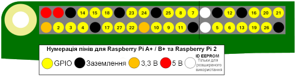

GPIO – це абревіатура для **G**eneral **P**urpose **I**nput/**O**utput (інтерфейс введення/виведення загального призначення). Raspberry Pi має 26 або 40 GPIO-пінів. Вони дозволяють надсилати та приймати сигнали вмикання/вимикання до та від електронних компонентів, таких як світлодіоди, двигуни та кнопки.

Якщо подивитися на Raspberry Pi з USB-портами, повернутими до тебе, розташування GPIO-пінів буде виглядати наступним чином.

|            |            |
| ----------:|:---------- |
|        3V3 | 5V         |
|  **GPIO2** | 5V         |
|  **GPIO3** | GND        |
|  **GPIO4** | **GPIO14** |
|        GND | **GPIO15** |
| **GPIO17** | **GPIO18** |
| **GPIO27** | GND        |
| **GPIO22** | **GPIO23** |
|        3V3 | **GPIO24** |
| **GPIO10** | GND        |
|  **GPIO9** | **GPIO25** |
| **GPIO11** | **GPIO8**  |
|        GND | **GPIO7**  |
|        DNC | DNC        |
|  **GPIO5** | GND        |
|  **GPIO6** | **GPIO12** |
| **GPIO13** | GND        |
| **GPIO19** | **GPIO16** |
| **GPIO26** | **GPIO20** |
|        GND | **GPIO21** |

Each pin has a number, and there are additional pins that provide 3.3 Volts, 5 Volts, and Ground connections.

Ось ще одна схема, яка показує розташування пінів. Також вона показує деякі додаткові спеціальні піни.

Ось таблиця з коротким поясненням.

| Скорочення        | Повна назва | Призначення                                                                          |
| ----------------- | ----------- | ------------------------------------------------------------------------------------ |
| 3V3               | 3,3 вольта  | Все, що підключено до цих пінів, постійно отримуватиме напругу 3,3 В                 |
| 5V                | 5 volts     | Anything connected to these pins will always get 5V of power                         |
| GND               | ground      | Zero volts, used to complete a circuit                                               |
| GP2               | GPIO pin 2  | These pins are for general-purpose use and can be configured as input or output pins |
| ID_SC/ID_SD/DNC |             | Special purpose pins                                                                 |
