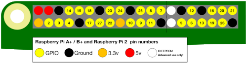

GPIO（英語：General-purpose input/output），通用型之輸入輸出的簡稱。 Raspberry Pi具有26個腳位。 您可以透過這些腳位收發開/關信號予其它電子組件（如LED，馬達和按鈕）。

USB端口朝向您時，GPIO腳位的佈局如下。

|            |            |
| ----------:|:---------- |
|        3V3 | 5伏         |
|  **GPIO2** | 5伏         |
|  **GPIO3** | 地線         |
|  **GPIO4** | **GPIO14** |
|         地線 | **GPIO15** |
| **GPIO17** | **GPIO18** |
| **GPIO27** | 地線         |
| **GPIO22** | **GPIO23** |
|        3V3 | **GPIO24** |
| **GPIO10** | 地線         |
|  **GPIO9** | **GPIO25** |
| **GPIO11** | **GPIO8**  |
|         地線 | **GPIO7**  |
|        DNC | DNC        |
|  **GPIO5** | 地線         |
|  **GPIO6** | **GPIO12** |
| **GPIO13** | 地線         |
| **GPIO19** | **GPIO16** |
| **GPIO26** | **GPIO20** |
|         地線 | **GPIO21** |

每個腳位都有一個數字，並且還有其他腳位可提供3.3伏、5伏和接地線。

這是另一幅顯示了腳位的佈局圖。 它還顯示了一些可選的特殊腳位。

以下是簡介

| 縮寫                    | 全名      | 功能                    |
| --------------------- | ------- | --------------------- |
| 3V3                   | 3.3伏    | 提供 3.3V 電源            |
| 5V                    | 5伏      | 提供 5V 電源              |
| GND                   | 接地線     | 地線 0V，用於形成迴路          |
| GP2                   | GPIO腳位2 | 這些腳位是通用的，可以配置為輸入或輸出腳位 |
| ID_SC / ID_SD / DNC |         | 專用腳位                  |
